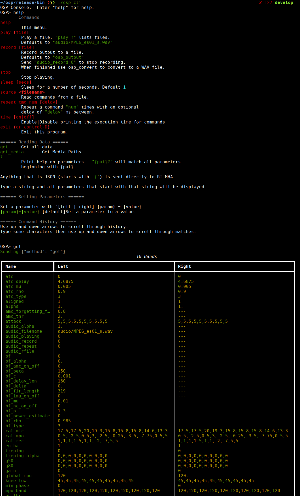

# OSP Documentation

This describes how the RT-MHA (osp) process
works.  It will not go into details about the algorithms.

## Building

### Requirements

The following Debian/Ubuntu packages must be installed
* cmake
* portaudio19-dev
  
### Compiling

`make` or `make release` builds an optimized binary.

The binaries will be built in the `release` or `debug` directory.  

The default installation directory is `../release` or `../debug`

You can set a different installation directory by setting the `PREFIX`
environment variable. You will need to run using `sudo` if you install
into a system directory.

```
/opt/osp/libosp (develop)> sudo PREFIX=/usr/local make release
```

### Running

You must first set the environment variable `OSP_MEDIA` before running osp.

```
/opt2/OSP/libosp-dev > export OSP_MEDIA=/opt/osp/ewsnodejs-server/src/utils/audio
/opt2/OSP/libosp-dev > ./release/src/osp
OSP (RT-MHA) Version 0.9-9-g57eeead
New process started at PID 83145
ALSA lib pcm_dsnoop.c:641:(snd_pcm_dsnoop_open) unable to open slave
ALSA lib pcm_dmix.c:1089:(snd_pcm_dmix_open) unable to open slave
ALSA lib pcm.c:2642:(snd_pcm_open_noupdate) Unknown PCM cards.pcm.rear
ALSA lib pcm.c:2642:(snd_pcm_open_noupdate) Unknown PCM cards.pcm.center_lfe
ALSA lib pcm.c:2642:(snd_pcm_open_noupdate) Unknown PCM cards.pcm.side
ALSA lib pcm_oss.c:377:(_snd_pcm_oss_open) Unknown field port
ALSA lib pcm_oss.c:377:(_snd_pcm_oss_open) Unknown field port
ALSA lib pcm_usb_stream.c:486:(_snd_pcm_usb_stream_open) Invalid type for card
ALSA lib pcm_usb_stream.c:486:(_snd_pcm_usb_stream_open) Invalid type for card
ALSA lib pcm_dmix.c:1089:(snd_pcm_dmix_open) unable to open slave
Input latency: 0.002
Output latency: 0.003
ALSA lib pcm.c:8526:(snd_pcm_recover) underrun occurred
ALSA lib pcm.c:8526:(snd_pcm_recover) underrun occurred
Expression 'err' failed in 'src/hostapi/alsa/pa_linux_alsa.c', line: 3355
Expression 'ContinuePoll( self, StreamDirection_In, &pollTimeout, &pollCapture )' failed in 'src/hostapi/alsa/pa_linux_alsa.c', line: 3896
Expression 'PaAlsaStream_WaitForFrames( stream, &framesAvail, &xrun )' failed in 'src/hostapi/alsa/pa_linux_alsa.c', line: 4274
10
Stream failed.  Retrying...
Input latency: 0.002
Output latency: 0.003
ALSA lib pcm.c:8526:(snd_pcm_recover) underrun occurred
ALSA lib pcm.c:8526:(snd_pcm_recover) underrun occurred
ALSA lib pcm.c:8526:(snd_pcm_recover) underrun occurred
ALSA lib pcm.c:8526:(snd_pcm_recover) underrun occurred
2996
2990
OSP RUNNING
```

Notice the errors starting with "Expression".  These internal portaudio/alsa errors
have proven to be difficult to prevent.  As a workaround, the audio startup code will
keep trying until it gets a stable connection.  `OSP RUNNING` is printed when it is finished.

### Setting Priorities (Linux Only)

`osp` will attempt to run some threads using the realtime scheduler.  Attempting to set
the scheduler will fail if the user does not have proper permissions.  You will see a message
like

```
set_cpu_pri : pthread_setschedparam failed
```

If your system is powerful enough and there aren't many competing tasks, everything should
still work fine.  If not, the audio will glitch and you may see messages like
```
LSA lib pcm.c:8526:(snd_pcm_recover) underrun occurred
ALSA lib pcm.c:8526:(snd_pcm_recover) underrun occurred
ALSA lib pcm.c:8526:(snd_pcm_recover) underrun occurred
Expression 'err' failed in 'src/hostapi/alsa/pa_linux_alsa.c', line: 3355
Expression 'ContinuePoll( self, StreamDirection_In, &pollTimeout, &pollCapture )' failed in 'src/hostapi/alsa/pa_linux_alsa.c', line: 3896
Expression 'PaAlsaStream_WaitForFrames( stream, &framesAvail, &xrun )' failed in 'src/hostapi/alsa/pa_linux_alsa.c', line: 4274
```
and the audio will stop.  In this case, you may want to set switch to using the realtime scheduler.

You can easily verify is you have permission to do so by typing "ulimit -r" into a terminal.  If
it returns "0", you will need to make some changes.

Using 'sudo', and an editor such as vi or nano, edit `/etc/security/limits.conf`
```
> sudo vi etc/security/limits.conf

```

Add two lines to the bottom which will look like this:
```
username		soft	rtprio	99
username		hard	rtprio	99
```
where you replace 'username' with your username.

You will need to completely log out of the system or reboot.

When you reboot, `ulimit -r` should return "99".


### osp_cli

The `osp_cli` program provide a convenient way to monitor, interact with, or test `osp`.
It is installed as `osp_cli` and is also runnable as `libosp/bin/osp_cli.py`.

  
