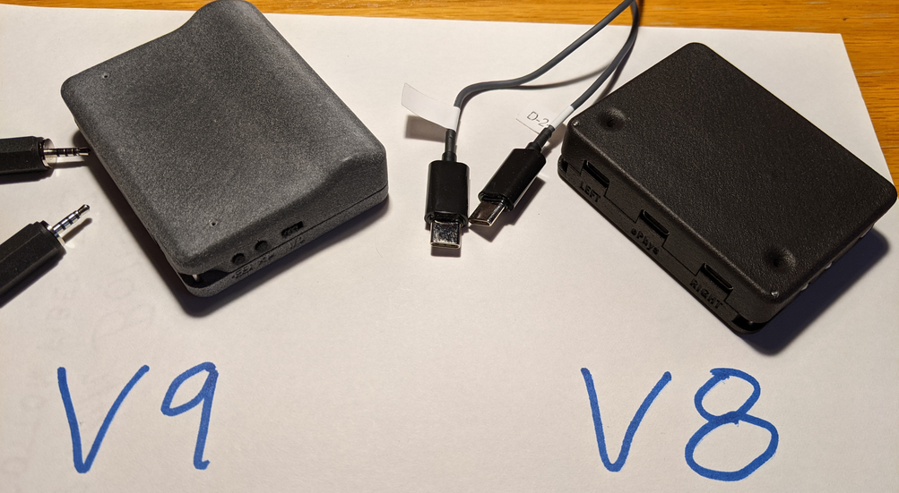
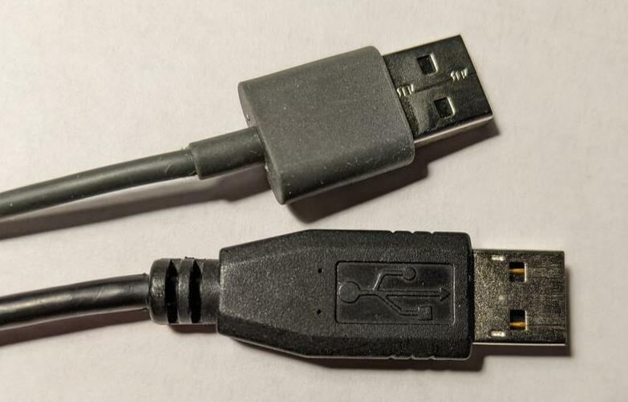
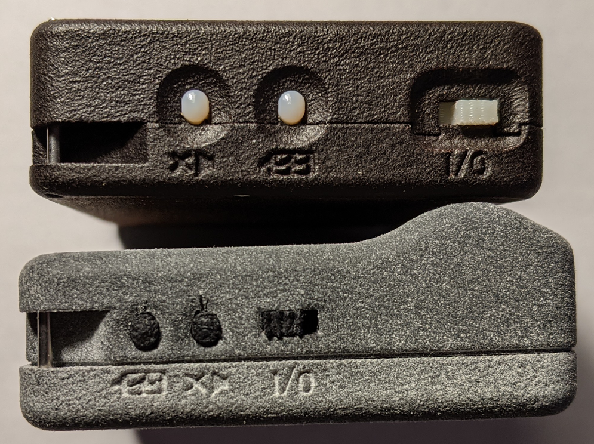

% PCD Software Installation and Configuration

## Updating and Using the OSP Hardware

This document describes how to install new software on an OSP
Processing and Communication Device (PCD).  It also tells how to 
connect to the device using a serial port and ssh and customize the device
operation.  Familiarity with Linux is assumed.

The hardware guides are located [here](https://github.com/nihospr01/OpenSpeechPlatform-UCSD/tree/master/OSP%20Hardware%20Documentation)


## Uncompressing the Image Zip File

Extract the contents of the zip file and change directory into it.  This README, device images, and all necessary utilities are included.

## PCD Versions

This software supports two hardware revisions, which we are calling "V8" and "V9". 




## Attaching the Device 

The V8 device has two micro-usb ports labelled "UART" and "ADB".  Attach cables to both and plug into your computer or a USB hub.  The V9 device has a single micro-usb port.  Attach it to your computer or usb hub attached to your computer.  The micro-usb ports are used for charging, flashing, and connecting as a serial port.

Be sure to use real micro-usb cables.  Some cables are "charge-only" and cannot exchange data.  The  easiest way to tell the difference is that the real usb cables have the USB trident logo.  **Update:  some cables have the logo and still are charge-only.**



The top cable is a "charge-only" usb cable. Do not use.

## Installing Required Software

For Linux, you must install the "fastboot" package from android tools.
Usually this is just "sudo apt install fastboot".

For Mac and Linux, python 3 is required.  There are two non-standard python packages
used by "pcdtool". You can install them with "pip3 install pyserial colorama".
You may need to prefix this with "sudo" depending on how python is installed
on your system.

For Windows, see [the Windows Installation document](WINDOWS.md) for installation instructions.


## Flash the Image to the Device

The `pcdtool` utility can flash the filesystem, boot the device, connect to it, and transfer files to and from it.

```
> ./pcdtool
usage: pcdtool [-h] [--version] {connect,conn,flash,recv,send} ...

Serial port utility for PCD Devices

pcdtool conn[ect]
    Connects to attached pcd device and displays output. Hit ^Z to exit.

pcdtool flash [-b]
    Connects to attached pcd device, flashes the the rootfs
    and restarts the device.  If -b flag is there, it first flashes the bootloader.
    
pcdtool send {filename}
    Sends the file to the current directory on the device.

pcdtool recv {filename}
    Receives a file from the device.

A device must first be connected via USB on /dev/ttyUSB0 (or /dev/cu.usbserial* for Mac)

positional arguments:
  {connect,conn,flash,recv,send}

optional arguments:
  -h, --help            show this help message and exit
  --version             Print version and exit
```

### Setting the Device to Boot Mode

To flash the device, it must first be set to Boot mode.  Turn the power on while holding the button closest to the power switch.  (Mute on V9, Battery Button on V8). You can release the button once it is switched on.  V8 devices look like this:

 

For V9 devices, be aware that some units have the power label wrong and devices will be on when the switch is over "0".

### Using pcdtool to Flash
```
> ./pcdtool flash

 FLASHING DEVICE.  Hold mute button and power on device

Flashing rootfs and rebooting

sending 'boot' (16406 KB)...
OKAY [  0.518s]
writing 'boot'...
OKAY [  0.342s]
finished. total time: 0.860s

target reported max download size of 268435456 bytes
sending sparse 'rootfs' 1/19 (230025 KB)...
```

If something goes wrong, perhaps the bootloader has been corrupted.  It that case, you should try `./pcdtool flash -b`


## Connecting to the Device Using the Serial Port

You can use a terminal program to connect to the usb port (/dev/ttyUSB0 on Linux or /dev/cu.usbserial* for Mac). `putty` works well. Use a baud rate of 115200.

However, `pcdtool` also works well as a terminal program.  Just run
```
> ./pcdtool conn

Hit Ctrl-Z to exit

OSP VERSION: 1.0

Hotspot Mode
Connect to the device at SSID "ospboard" password "hearingaid" then
open a browser and connect to http://192.168.8.1:5000 and/or http://192.168.8.1
If you wish to put the board back into NetworkManager mode then use following command:

set_mode nm
root@ospboard:~> 
root@ospboard:~> 
```
You may need to hit <enter> once or twice to get a prompt.

### Linux Troubleshooting

If you get an error like `can't open device "/dev/ttyUSB0": Permission denied`,
you need to add yourself to the 'dialout' group.

```
> sudo usermod -a -G dialout $USER
```

After this you will need to log out entirely (or reboot).  Check that you are in the
groups with the `groups` command

```
> groups
mmh adm dialout cdrom sudo dip plugdev lpadmin sambashare docker
```

### After Flashing

After flashing you should see "ospboard" show up in the wifi ssid list on a laptop or cell phone.
You should also be able to connect to the device with a serial connection over the USB cable.
You should be able to see lights flashing inside the case.

## Using Wifi and SSH

When first flashed, the device is in "HotSpot" which allows
you to connect to it using a phone or computer by connecting to
its wifi SSID.  The advantage of this is the device has a consistent IP address
and is not dependant on any external wifi router. The disadvantage is the
device has no internet connectivity and when you connect your phone or laptop 
to the PCD, it will lose internet too.

NetworkManager mode tells the PCD device to connect to a local wifi
SSID.  Its address will be allocated by the wifi router.

You can check the mode by typing "print_mode"


### HotSpot Mode

In HotSpot mode, "print_mode" returns this:

```
root@ospboard:~> print_mode
Hotspot Mode
Connect to the device at SSID "ospboard" password "hearingaid" then
open a browser and connect to http://192.168.8.1:5000 and/or http://192.168.8.1
If you wish to put the board back into NetworkManager mode then use following command:

set_mode nm
```

To use ssh to connect to the device, 
```
> ssh -i ospboard_id root@192.168.8.1
```

"ospboard_id" is a file containing an ssh key that is included in the zip file.
To simplify ssh connections to the PCD, you should copy `ospboard_id`
to ~/.ssh and add an entry to your `.ssh/config` file such as:

```
Host osp_hs
     HostName  192.168.8.1
     User root
     IdentityFile ~/.ssh/ospboard_id
```
Then you can just do `ssh osp_hs` to connect to a device in hotspot mode..  

#### Setting the HotSpot SSID

You can set the HotSpot SSID and passphrase. 
```
root@ospboard:~> set_hs_name -n ospboard2 -p my_password
Done. Reboot for changes to take effect

root@ospboard:~> print_mode
Hotspot Mode
Connect to the device at ssid=ospboard2 with wpa_passphrase=my_password
open a browser and connect to http://192.168.8.1:5000 and/or http://192.168.8.1
If you wish to put the board back into NetworkManager mode then use following command:

set_mode nm
```


### NetworkManager Mode

When you type "set_mode nm", the device reboots then you see something like this
with a list of SSIDs the device can see. (The list may not be complete,
so you can always try other SSIDs.)

```
root@ospboard:~> print_mode
NetworkManager Mode
Connect to your wifi with one of the following:
> nmcli dev wifi con MYSSID password "MY PASSWORD"
or
> nmtui
IN-USE  SSID  MODE   CHAN  RATE        SIGNAL  BARS  SECURITY 
        DNRC  Infra  1     130 Mbit/s  49      __  WPA2     
        DNRC  Infra  6     130 Mbit/s  42      __  WPA2     
        DNRC  Infra  6     130 Mbit/s  40      __  WPA2     
If you wish to put the board back into hotspot mode then use following command:

set_mode hs
```

Connect to your wifi.
```
root@ospboard:~> nmcli dev wifi con MYSSID password "MY PASSWORD"
[  203.944162] wlan0: authenticate with 70:3a:cb:2a:06:d8
[  203.989349] wlan0: send auth to 70:3a:cb:2a:06:d8 (try 1/3)
[  204.000409] wlan0: send auth to 70:3a:cb:2a:06:d8 (try 2/3)
[  204.002978] wlan0: authenticated
[  204.006728] wlan0: associate with 70:3a:cb:2a:06:d8 (try 1/3)
[  204.023939] wlan0: RX AssocResp from 70:3a:cb:2a:06:d8 (capab=0x1431 status=0 aid=4)
[  204.057159] wlan0: associated
[  204.164330] IPv6: ADDRCONF(NETDEV_CHANGE): wlan0: link becomes ready
Device 'wlan0' successfully activated with '2ce4abfd-9c36-446c-9a25-6511d85c9dea'.

root@ospboard:~> print_mode
NetworkManager Mode
        inet 192.168.86.38  netmask 255.255.255.0  broadcast 192.168.86.255
Connected
If you wish to put the board back into hotspot mode then use following command:

```

Note the assigned IP address.  It will be different for your network.  

You can also use "ospboard.lan" or "ospboard.local" as the address.  One
or both should work on your network. If you have multiple devices
on the same LAN, use "set_hs_name -n" to set the hostname to something other
than "ospboard"

The device is now running wifi and will continue to use this mode after reboots.
You can now hit control-z to exit from the terminal.  You can also disconnect the
USB cable it you want.  (You will periodically need to reconnect it to a charger to recharge the battery)

From another computer you can connect like this, 
```
> ssh -i ospboard_id root@ospboard.lan
```

**If you are not using "ospboard.lan", you might want to tell your wifi router to reserve the address 
for your device so it doesn't change in the future.**

To simplify ssh connections to the PCD, you should copy `ospboard_id`
to ~/.ssh and add an entry to your `.ssh/config` file such as:

```
Host osp
     HostName  ospboard.lan
     User root
     IdentityFile ~/.ssh/ospboard_id
```

Then you can just do `ssh osp`.  

## Using Visual Studio Code

[Visual Studio Code](https://code.visualstudio.com/) with the [Remote SSH Extension](https://marketplace.visualstudio.com/items?itemName=ms-vscode-remote.remote-ssh) is a great way to do development on the device.  You will need to setup your ~/.ssh/config file as described above.

## Monitoring and Controlling the OSP Processes


OSP has three process that are started automatically in /etc/rc.local
```
    ionice -c 1 /opt/release/bin/osp -m > /var/log/osp.log &
	/opt/release/bin/start-ews > /var/log/ews.log &
	/opt/release/bin/start-ews-php > /var/log/ews-php.log &
```

You can cat or tail the log files.  You can also kill any of the processes you don't need.

For `osp` you can monitor CPU usage with `ps_osp`.  `osp` runs realtime threads
in CPUs 1-3.  
```
root@ospboard:~> ps_osp
CPUID CLS PRI %CPU   LWP COMMAND
    0  TS  19  0.0   558 OSP
    1  FF 130 22.3   566 OSP: Chan 0
    2  FF 130 21.8   567 OSP: Chan 1
    3  FF  41 13.0   607 OSP: AudioCB
```

In the above example, `kill 558`  will kill all the OSP threads.  You can restart it later with
`nohup ionice -c 1 /opt/release/bin/osp -m > /var/log/osp.log &`

If you wish to disable all the OSP processes, simply create a
file named `/root/.no_osp_startup` and reboot.  As long as that file exists,
OSP will not be run on startup.

### Device Temperature

To check the CPU temperature, just type `temp`.  To monitor the temperature every 5 seconds, use
`temp -t 5`

## Charging the Device

Unfortunately the devices do not currently have a way to measure the battery level.
They also have some charging quirks you should be aware of.  These should be fixed in later hardware revisions.

If a device in hotspot mode is not creating an "ospboard" SSID, the battery may be too low.  If it is networkmanager mode and you cannot ping or ssh to it, the battery is likely discharged.

### V9 Device Charging

V9 devices will charge when powered on and when powered off, BUT only if the device is turned off while the USB port is connected.  

If a device is not responding, attach a USB cable and plug it into a computer or charger. 
Turn the power on.  Normally the device will charge briefly then start working. If it does not start after 15 minutes, turn the device off then on again.  It may take 6-8 hours to fully charge.  

If you disconnect the USB cable or unplug the charger/laptop, keep the device power on.  Once it is moved, wait 10 seconds then you can turn the power off and it will keep charging.  If the device was off, you should turn it on, wait 30-40 seconds then turn it off.

### V8 Device Charging

V8 devices charge whenever the USB port labelled "ADB" is connected.

### System Check

To see a summary of the system status, type "system_check"
                        s
### Setting the Time Zone

If you need correct times from the device, you must set the time zone.

You can get a list of time zones with the command `timedatectl list-timezones`.
Then you set the timezone with `timedatectl set-timezone <your zone>`, putting in your desized time zone.
For example, `timedatectl set-timezone America/Los_Angeles`.

## openMHA

To use openMHA with the PCD, your config files must set the following to
get live input from the mics:
```
srate = 48000
iolib=MHAIOPortAudio
io.device_index_in=1
io.device_index_out=0
```

You should disable OSP processing by either creating a
file named `/root/.no_osp_startup` and rebooting OR
killing the osp process like this:

```bash
root@ospboard:/opt/openMHA/examples/00-gain> ps_osp
CPUID CLS PRI %CPU   LWP COMMAND
0  TS  19  0.0   534 OSP
1  FF 130 20.2   544 OSP: Chan 0
2  FF 130 19.5   545 OSP: Chan 1
3  FF  41 14.1   579 OSP: AudioCB
root@ospboard:/opt/openMHA/examples/00-gain> kill 534
```

The following examples in /opt/openMHA/examples have been tested and should work:

- 00-gain/gain_live_getting_started.cfg
- 00-gain/gain_live.cfg
- 00-gain/gain_live_double.cfg
- 01-dynamic-compression/dynamiccompression_live.cfg
- 17-PHL-generic-hearing-aid/generic-hearing-aid/index.cfg

