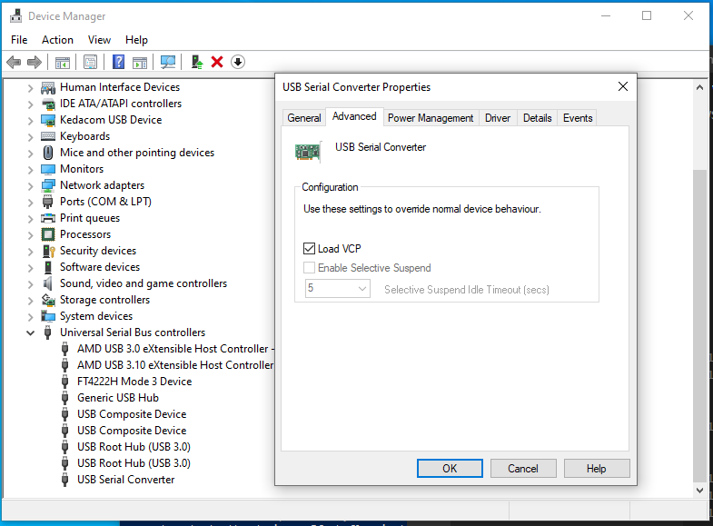
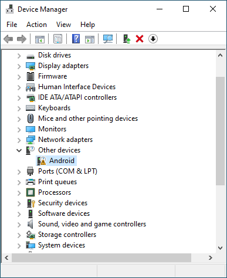
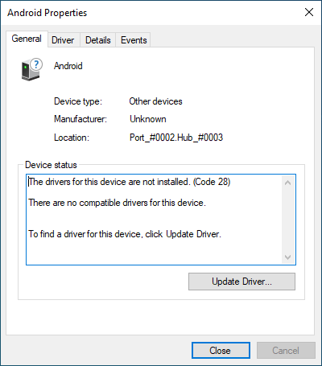
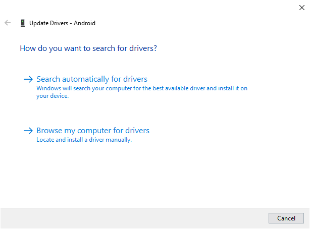
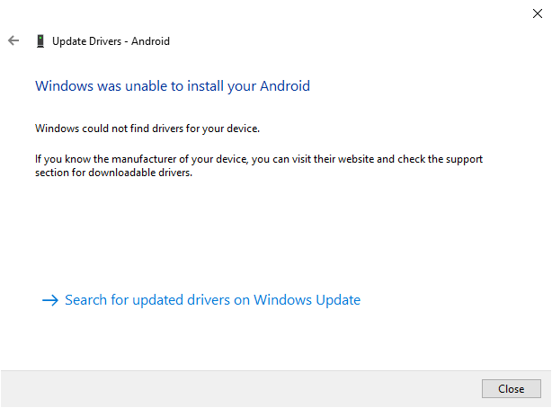
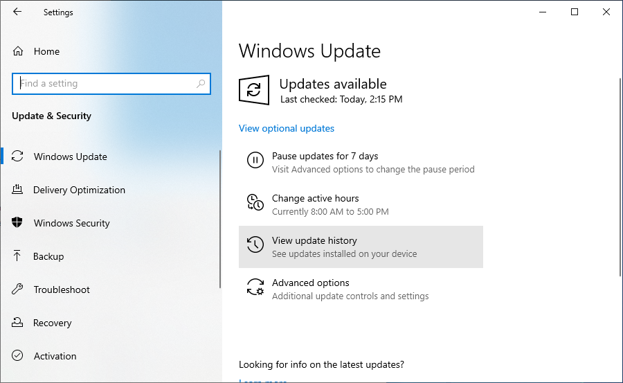
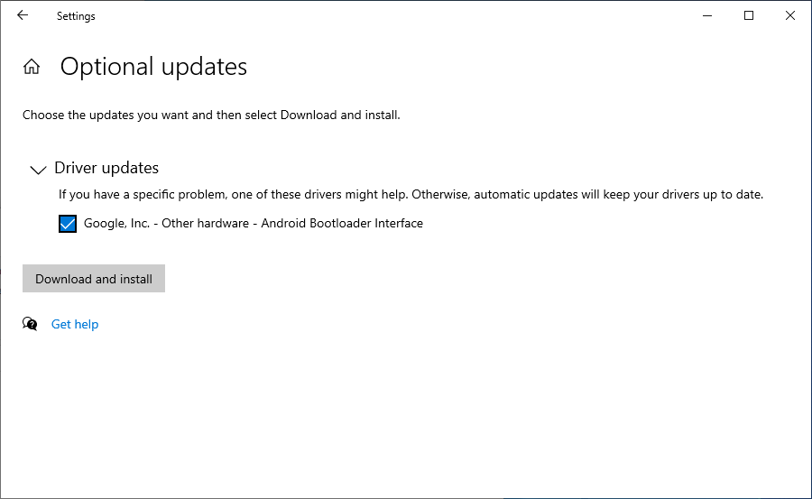
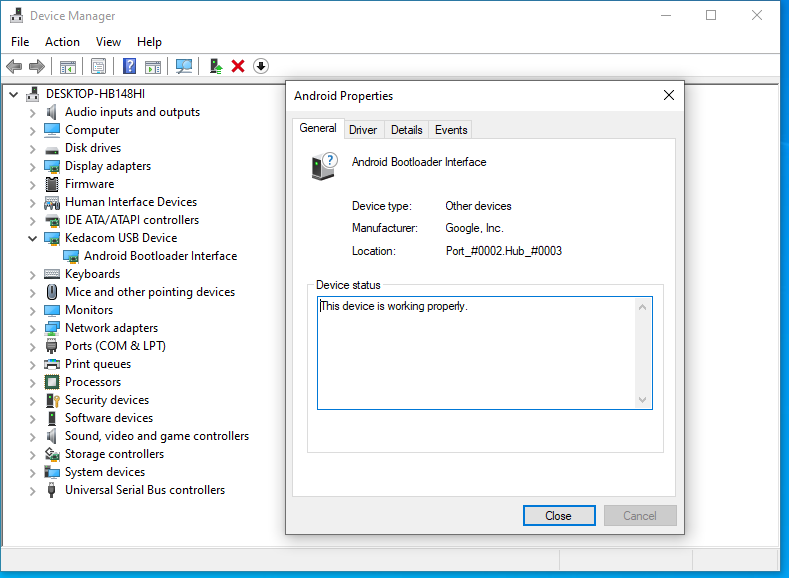

# Windows Installation

## Installing Drivers

1. Run CDM21228_Setup (in the win subfolder) to install the FTDI USB drivers.

2. Connect the device with a micro-USB cable to your Windows computer.   Open the Device Manager.  Slide the device power switch on.  You should see "FT4222H Mode 3 Device" show up under the "Universal Serial Bus Controllers" section.  You should also see
"USB Serial Converter".  CLick on that and then select the "Advanced" tab.  Make sure "Load VCP" is selected.



3.  Turn the device off, then turn on the device in boot mode (by holding the button closest to the power switch while
turning the power on).  You should see "Other Devices / Android"
appear.  (You may have to retry a couple of times to get the device in boot mode.)



4. Select "Other Devices / Android".  Then click on "Update Driver"



5. Select "Search Automatically for Driver"



6. Select "Search for updated drivers on Windows Update"



7. Select "View optional updates"



8. Select "Google Inc - Other hardware - Android Bootloader Interface"



9.  The Device Manager should now show "Kedacom USB Device / Android Bootloader Interface" and it should be working properly.



## Flashing the Device

Unzip the zip file and open a powershell.  You should see something like this:

```
PS C:\Users\huntm\pcd-20Feb21> ls

    Directory: C:\Users\huntm\pcd-20Feb21

Mode                 LastWriteTime         Length Name
----                 -------------         ------ ----
d-----         2/24/2021   3:50 PM                opt
d-----         2/24/2021   3:01 PM                win
------         2/22/2021   3:19 PM           1823 ospboard_id
-a----         2/24/2021   4:08 PM        6922874 pcdtool.exe
-a----         2/24/2021   4:08 PM           7007 pcdtool.py
------         2/22/2021   3:19 PM        2107578 README-20Feb21.pdf
```

`pcdtool.py` is the python version of pcdtool.  You can use it if you have a full python installation installed. You will probably want to use `pcdtool.exe` instead. 

You can flash the device by putting it into boot mode.  Then you can use pcdtool:

``` 
PS C:\Users\huntm\pcd-20Feb21> .\pcdtool flash
FLASHING DEVICE.  Hold mute button and power on device

Flashing rootfs and rebooting

Sending 'boot' (16414 KB)                          OKAY [  0.625s]
Writing 'boot'                                     OKAY [  0.344s]
Finished. Total time: 1.047s

Sending sparse 'rootfs' 1/18 (230206 KB)           OKAY [  9.203s]
Writing 'rootfs'                                   OKAY [  5.474s]
Sending sparse 'rootfs' 2/18 (241364 KB)
...
```

If pcdtool does not work for you, you can also flash the device manually by issuing these three commands.

```
PS C:\Users\huntm\pcd-20Feb21> .\win\fastboot.exe flash:raw boot .\opt\osp\var\build\boot-v9.img
Sending 'boot' (16414 KB)                          OKAY [  0.638s]
Writing 'boot'                                     OKAY [  0.344s]
Finished. Total time: 1.011s

PS C:\Users\huntm\pcd-20Feb21> .\win\fastboot.exe flash:raw boot .\opt\osp\var\build\boot-v9.img
Sending 'boot' (16414 KB)                          OKAY [  0.638s]
Writing 'boot'                                     OKAY [  0.344s]
Finished. Total time: 1.011s
...

PS C:\Users\huntm\pcd-20Feb21> .\win\fastboot.exe reboot
Rebooting
```


### Connecting to the Serial Port

You can use a serial port program like putty to connect to the device with a baud rate of 115200.

Or you can use `pcdtool`

```
PS C:\Users\huntm\pcd-20Feb21> .\pcdtool.exe conn
Trying COM3: USB Serial Port (COM3) [USB VID:PID=0403:6015 SER=DT04N58UA]

Hit Ctrl-Z to exit


root@ospboard:~> ps_osp
CPUID CLS PRI %CPU   LWP COMMAND
    0  TS  19  0.0   603 OSP
    1  FF 130 25.9   613 OSP: Chan 0
    2  FF 130 25.3   614 OSP: Chan 1
    3  FF  41 15.6   639 OSP: AudioCB
root@ospboard:~>

```
